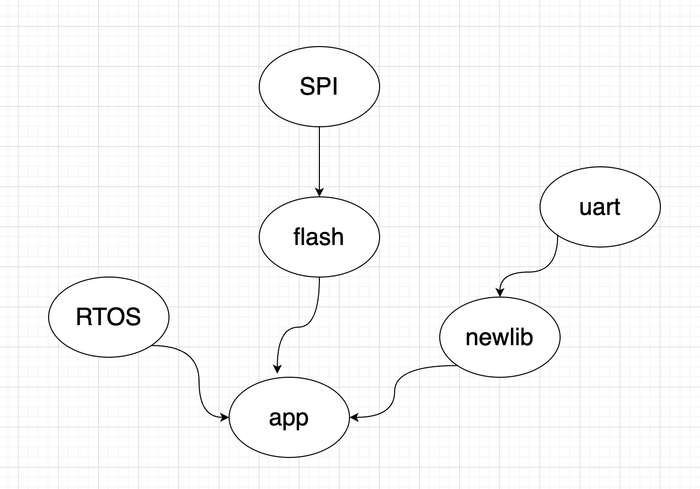

该build system使用cmake作为构建工具，采用分模块构建思想，模块与模块之间可以存在依赖关系，各个app工程只需要选择必要模块。

如下面 m3 rtos 工程案例：

目前的模块分了两类，分别位于如下目录，请注意区分：

- hw: 包含各个硬件IP的驱动，如uart,spi,timer...

- libs: 包含各种软件驱动库，如flash,libc,rtos...

### 如何添加新的模块？

分为两步：

1. 在hw or libs目录下，添加模块目录和源文件，编写模块级编译规则CmakeLists.txt

2. 和bare-metal构建系统关联，在根目录下的CMakeLists.txt中添加编译规则

模块编译规则，可以参考libs/flash/nor/CMakeLists.txt。

模块与构建系统关联，可以参考根目录CMakeLists.txt的146行开始。

# 推荐阅读

1. [cmake官方文档]([CMake Reference Documentation — CMake 3.24.2 Documentation](https://cmake.org/cmake/help/latest/))

2. [More Modern CMake Introduction]([More Modern CMake (hsf-training.github.io)](https://hsf-training.github.io/hsf-training-cmake-webpage/aio/index.html))
