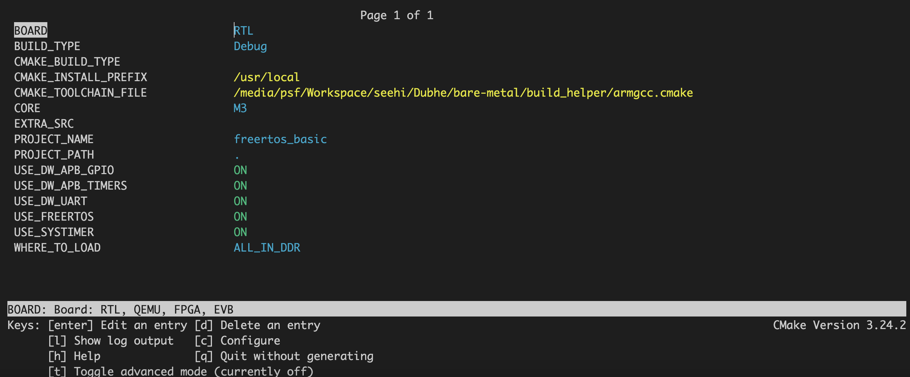

# Quick Start

app/a55/hello/build.sh

app/m3/freertos_basic/build.sh

app/cv32e40p/hello/build.sh

上述3个脚本包含了编译3个不同cpu的app工程的简单编译测试。

# Build

## Prerequisites

1. Download appropriate GNU toolchains

2. GNU Make

3. Morden CMake >= 3.15

## Build Options

### Common build options

- **PROJECT_NAME**:设置project name，生成的目标文件以此为名。

- **PROJECT_PATH**:设置app.cmake文件路径，该文件设置工程的需要编译的源文件&模块。

- **CROSS_COMPILE**:设置跨平台编译器。

- **EXTRA_SRC**:可以添加一个额外的源文件。

- **CORE**:A55, M3, CV32E40P.

- **OS**:NO_SYS, FreeRTOS.

- **BOARD**:RTL, QEMU, FPGA, EVB.

- **BUILD_TYPE**:Debug, FastRel, FastRelWithDebInfo, MinSizeRel, MinSizeRelWithDebInfo.

- **WHERE_TO_LOAD**:ROM, ALL_IN_SYSRAM, ALL_IN_DDR.

# Tips

1. ccmake可以在显示和修改工程配置信息(cmake-gui也可以)
   
   1. cmake -S ../../../ -B build -DPROJECT_NAME=hello -DPROJECT_PATH=. -DCORE=A55 -DBOARD=FPGA -DBUILD_TYPE=Debug -DWHERE_TO_LOAD=ALL_IN_DDR
   
   2. ccmake build

2. 添加新模块请阅读 docs/how_to_create_new_module.md.
